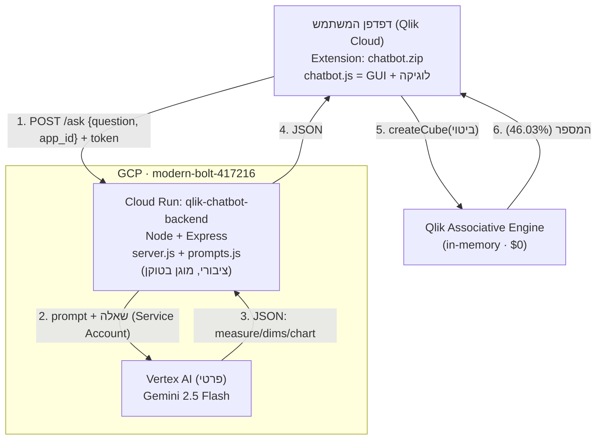

# ארכיטקטורה — Qlik Chatbot (תעסוקה ופריון / חירום)

## דיאגרמת זרימה + גבולות אבטחה

```
┌────────────────────────── אינטרנט ציבורי ──────────────────────────┐
│                                                                      │
│   ┌──────────────────────────────────────┐                          │
│   │  דפדפן המשתמש  (בתוך Qlik Cloud)       │                          │
│   │                                        │                          │
│   │   Extension = chatbot.zip              │                          │
│   │   ├─ chatbot.qext  (תעודת זהות)        │                          │
│   │   └─ chatbot.js    (GUI + לוגיקה)      │                          │
│   │        • בונה את תיבת הצ'אט (HTML)     │                          │
│   │        • שולח שאלה ל-backend           │                          │
│   │        • מריץ את הביטוי מול Qlik       │                          │
│   │        • מצייר טבלה/גרף                │                          │
│   └───────┬───────────────────────▲────────┘                          │
│           │                       │                                   │
│   (1) POST /ask                (4) JSON                               │
│   {question, app_id}        {measure, dims, chart}                    │
│   + X-Backend-Token               │                                   │
│           │                       │                                   │
└───────────┼───────────────────────┼───────────────────────────────────┘
            │                       │
   ╔════════▼═══════════════════════┴════════════════════════════════╗
   ║                  GCP — project: modern-bolt-417216               ║
   ║                                                                  ║
   ║   ┌────────────────────────────────────────┐                    ║
   ║   │  Cloud Run:  qlik-chatbot-backend        │  ← ציבורי         ║
   ║   │  (Node.js + Express, קונטיינר Docker)    │    (allUsers)      ║
   ║   │                                          │    מוגן בטוקן+CORS ║
   ║   │   server.js   ← השרת + אבטחה             │                    ║
   ║   │   prompts.js  ← ספר ההוראות לכל app      │                    ║
   ║   └───────┬──────────────────────▲───────────┘                    ║
   ║           │                      │                                ║
   ║   (2) prompt + שאלה          (3) טקסט JSON                        ║
   ║   (הזדהות: Service Account)       │                                ║
   ║           │                      │                                ║
   ║   ┌───────▼──────────────────────┴───────────┐                    ║
   ║   │  Vertex AI   ← פרטי לחלוטין (IAM בלבד)    │                    ║
   ║   │  └─ Gemini 2.5 Flash  (המודל / "המוח")    │                    ║
   ║   └──────────────────────────────────────────┘                    ║
   ╚══════════════════════════════════════════════════════════════════╝

   ┌──────────────────────────────────────────────────────────────────┐
   │  Qlik Associative Engine  (in-memory, בתוך האפליקציה)             │
   │  • chatbot.js קורא ל-createCube עם הביטוי מ-Gemini                │
   │  • Qlik מבצע את החישוב על הדאטה הטעון  →  המספר (למשל 46.03%)      │
   │  • עלות: $0  (אין BigQuery, הדאטה כבר בזיכרון)                    │
   └──────────────────────────────────────────────────────────────────┘
```

> **מי עושה מה:** Gemini *מתרגם* עברית → ביטוי Qlik (לא יודע את המספר).
> Qlik Engine עושה את *החישוב* האמיתי. chatbot.js מחבר ומציג.

---

## גרסת Mermaid (נרנדרת ב-GitHub / VS Code)



---

## שכבות — תקציר

| שכבה | טכנולוגיה | תפקיד | חשיפה |
|------|-----------|-------|--------|
| Extension | JS טהור + Qlik Capability API | GUI הצ'אט + הרצת השאילתה מול Qlik | רץ בדפדפן |
| Backend | Node.js + Express @ Cloud Run | תיווך מאובטח אל Gemini, בחירת prompt לפי app_id | **ציבורי** (טוקן+CORS+rate-limit) |
| LLM | Gemini 2.5 Flash @ Vertex AI | תרגום שאלה → ביטוי Qlik (JSON) | **פרטי** (Service Account בלבד) |
| Engine | Qlik Associative Engine | החישוב בפועל על הדאטה | בתוך האפליקציה · $0 |

## אבטחה / חשיפה — דגשים
- **Cloud Run** הוא הרכיב הציבורי היחיד, כדי שהדפדפן יוכל להגיע אליו. מוגן ב-`X-Backend-Token`, CORS מוגבל ל-`https://opisoftim.il.qlikcloud.com`, ו-rate-limit (30/דק').
- **Vertex/Gemini לעולם לא נחשף לאינטרנט.** ה-backend מזדהה אליו דרך Service Account (`roles/aiplatform.user`) — הזדהות פנימית של GCP, בלי מפתח API ובלי כתובת ציבורית.
- הפתיחה הציבורית של Cloud Run הוגדרה בעבר (`allUsers` → `run.invoker`), לא בסשן הזה.

## שירותי GCP בשימוש
| שירות | סטטוס |
|--------|--------|
| Cloud Run | היה קיים; פרסתי מחדש (revisions 00008→00011) |
| Vertex AI (Gemini) | היה מאופשר; לא שיניתי |
| Cloud Build | היה מאופשר; שימש לבניית ה-image בכל deploy |
| Artifact Registry | מאחסן את ה-image שנבנה (אוטומטי) |

*בסשן הזה לא הופעלו שירותים חדשים ולא נוצרו משאבים חדשים — רק פריסה מחדש של קוד.*